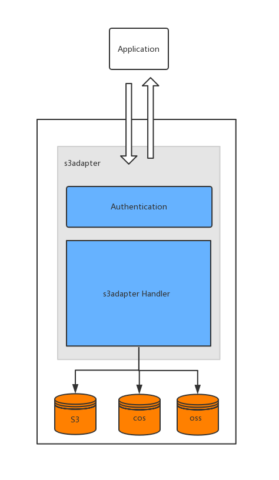

# 文档

<!-- TOC -->

- [文档](#文档)
    - [简介](#简介)
        - [支持后端引擎](#支持后端引擎)
        - [已经支持的方法](#已经支持的方法)
    - [安装](#安装)
        - [Docker](#docker)
        - [二进制](#二进制)
        - [源码](#源码)
    - [命令](#命令)
    - [配置](#配置)
        - [命令行参数](#命令行参数)
        - [环境变量](#环境变量)
        - [配置文件](#配置文件)
    - [程序使用](#程序使用)
        - [创建应用](#创建应用)
        - [使用 SDK 调用](#使用-sdk-调用)
    - [API 文档](#api-文档)

<!-- /TOC -->

## 简介

对象存储网关，使用统一的 S3 REST 接口进行对象存储操作，支持多种对象存储后端。



### 支持后端引擎

- s3(AWS)
- cos(腾讯云)

### 已经支持的方法

- CreateBucket
- HeadBucket
- ListBuckets
- ListObjects
- ListObjectsV2(部分后端不完全支持)
- DeleteBucket
- PutObject
- HeadObject
- GetObject
- DeleteObject
- CopyObject

## 安装

### Docker

```shell
$ docker run -ti  -p 8080:8080 s9/os_proxy:latest web \
  --show \
  --mysqlhost=docker.for.mac.host.internal \
  --httpport=8080
```

### 二进制

直接下载编译好的 [二进制文件](release)

### 源码

*Go version>=1.10 AND GO111MODULE=on*

```shell
$ go get github.com/solution9th/os_proxy
$ export GO111MODULE=on
$ make build
```

## 命令

```shell
$ ./os_proxy --help
A AWS S3-compatible CLI

Usage:
  os_proxy [command]

Available Commands:
  config      Just show config
  help        Help about any command
  version     Show version
  web         Start Web Server

Flags:
      --config string   config file (default is ./osconfig.yml)
  -h, --help            help for os_proxy

Use "os_proxy [command] --help" for more information about a command.
```

- config 查看程序当前环境下的配置文件路径和具体配置信息
- version 查看程序版本信息
- web 以 http 服务的形式启动程序
- `--config` 指定具体的配置文件，如果不指定则为可执行文件当前路径下的 `osconfig.yml` 文件

**建议使用 `os_proxy [command] --help` 查看具体信息**

## 配置

由于需要数据库连接和域名等信息，所以需要配置文件才能正常运行。

配置信息支持从命令行参数、环境变量、配置文件读取。

读取的优先级: **命令行参数 > 环境变量 > 配置文件 > 默认配置文件**

```shell
$ ./os_proxy web --help
Start Web Server

Usage:
  os_proxy web [flags]

Flags:
      --debug                  is debug
      --endpoint string        http end point
  -h, --help                   help for web
      --httpport string        http port (default "9091")
      --mysqldbname string     mysql databases
      --mysqlhost string       mysql host (default "127.0.0.1")
      --mysqlpassword string   mysql password
      --mysqlport int          mysql port (default 3306)
      --mysqluser string       mysql username (default "root")
      --pprofport string       pprof port (default "9092")
      --show                   show config

Global Flags:
      --config string   config file (default is ./osconfig.yml)
```

配置文件如果不通过 `--config` 命令指定则读取可执行程序同目录下的名称为 `osconfig.yml` 的配置文件

### 命令行参数

- `httpport`: http 服务监听的端口
- `pprofport`: pprof 服务监听的端口
- `logpath`: log 存放路径（为空则直接 stdout 输出）
- `mysqluser`: 数据库用户
- `mysqlpassword`: 数据密码
- `mysqlhost`: 数据库主机值
- `mysqlport`: 数据库端口
- `mysqldbname`: 数据库名称
- `--show`: 展示当前运行使用的配置信息(推荐测试时使用)
- `--endpoint`: 具体后端名称（例如: s3.amazon.com）
- `--debug`: 测试模式

### 环境变量

```shell
export OS_SERVER_ISDEBUG=true
export OS_SERVER_HTTPPORT=9091
export OS_SERVER_PPROFPORT=9092
export OS_SERVER_ENDPOINT=s3.newio.cc
export OS_MYSQL_PORT=3306
export OS_MYSQL_USER=root
export OS_MYSQL_PASSWD=xxx
export OS_MYSQL_HOST=127.0.0.1
export OS_MYSQL_DBNAME=s3
```

每个环境变量的作用一目了然。

### 配置文件

默认配置文件:

```yaml
server:
  httpport: "9091"
  pprofport: "9092"
  endpoint: "s3.newio.cc"
  isdebug: false

mysql:
  host: "127.0.0.1"
  port: 3306
  user: "root"
  passwd: "666666"
  dbname: "s3"
```

配置文件不需要全部参数填写，只需要填写与*默认配置信息*不同的配置即可，具体如下

```yaml
mysql:
  dbname: "s3_proxy"
```

注: 配置文件如果没有通过 `--config` 指定路径则默认读取二进制当前目录下的 `osconfig.yml`

## 程序使用

### 创建应用

通过 REST API 创建应用，创建应用后会获得一对 `AccessKey` 和 `SecretKey`。

这对秘钥指定了具体的后端引擎，所以当需要更换后端引擎是只需要创建新的应用即可。

- 方法

```http
PUT / HTTP/1.1
Host: s3.newio.cc
Content-Type: text/xml

<CreateApplicationConfiguration>
    <AccessKey>后端AccessKey</AccessKey>
    <SecretKey>后端SecretKey</SecretKey>
    <Engine>后端引擎的名称</Engine>
    <Region>后端引擎的区域</Region>
    <AppName>应用名称</AppName>
    <AppRemark>应用备注</AppRemark>
</CreateApplicationConfiguration>
```

- 请求

```xml
<CreateApplicationConfiguration>
    <AccessKey>后端AccessKey</AccessKey>
    <SecretKey>后端SecretKey</SecretKey>
    <Engine>后端引擎的名称</Engine>
    <Region>后端引擎的区域</Region>
    <AppName>应用名称</AppName>
    <AppRemark>应用备注</AppRemark>
</CreateApplicationConfiguration>
```

- 响应

```xml
<CreateApplicationResult xmlns="http://s3.amazonaws.com/doc/2006-03-01/">
    <AccessKey>yP7m8qHqo6tGnpZnpstw</AccessKey>
    <SecretKey>QLLrLCnNc14jUZ3pumD62Sjmwir2r6Ip2vhB9ury</SecretKey>
</CreateApplicationResult>
```

- 例子

```shell
$ curl -X PUT \
  https://os-proxy.develenv.com \
  -H 'Content-Type: application/xml' \
  -H 'Host: os-proxy.develenv.com' \
  -d '<CreateApplicationConfiguration>
    <AccessKey>123</AccessKey>
    <SecretKey>123</SecretKey>
    <Engine>s3</Engine>
    <Region>beijing</Region>
    <AppName>Test</AppName>
    <AppRemark>Test</AppRemark>
</CreateApplicationConfiguration>'
```

### 使用 SDK 调用

此项目兼容 AWS S3 服务，所以可以直接使用 AWS S3 SDK 进行调用此服务，具体示例 [/example/main.go](example/main.go)

```go
package main

import (
	"fmt"

	"github.com/aws/aws-sdk-go/aws"
	"github.com/aws/aws-sdk-go/aws/credentials"
	"github.com/aws/aws-sdk-go/aws/session"
	"github.com/aws/aws-sdk-go/service/s3"
)

func main() {

	var (
		accessKey  = "<new accessKey>"
		secretKey  = "<new secretKey>"
		region     = "<region>"
		endPoint   = "<endpoint>"
		bucketName = "<bucket name>"
	)

	sess, err := session.NewSession(&aws.Config{
		Endpoint:    aws.String(endPoint),
		Region:      aws.String(region),
		Credentials: credentials.NewStaticCredentials(accessKey, secretKey, ""),
	})
	if err != nil {
		panic(err)
	}

	client := s3.New(sess)

	output, err := client.CreateBucket(&s3.CreateBucketInput{
		Bucket: aws.String(bucketName),
	})
	if err != nil {
		panic(err)
	}

	fmt.Println(output.String())
}
```

## API 文档

[API](api.md)